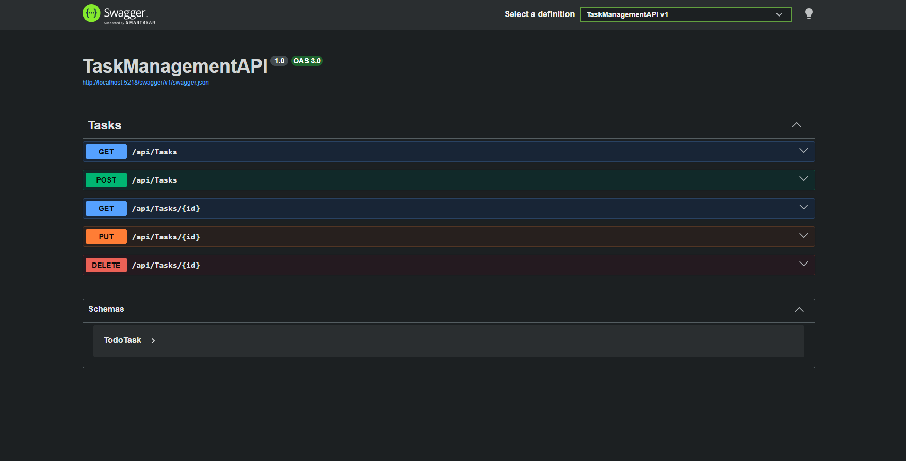
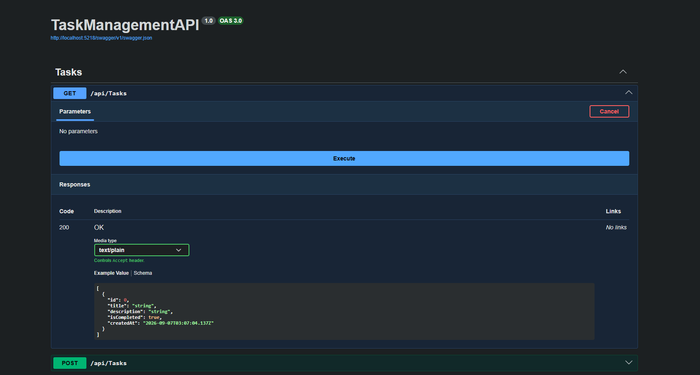
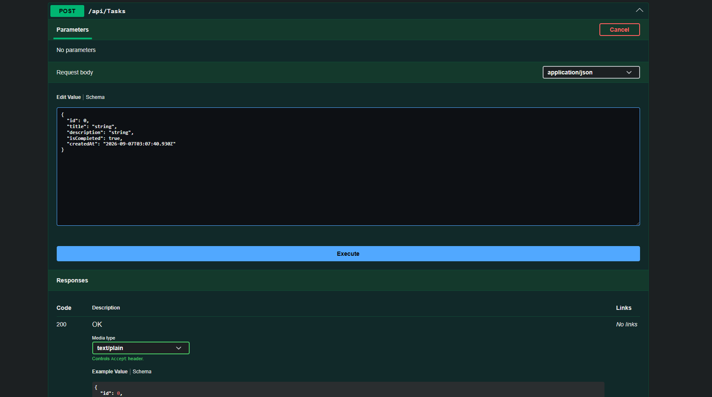

# Task Management API

A professional ASP.NET Core Web API for managing personal and team tasks efficiently. This project demonstrates backend development fundamentals in C#, RESTful API design, database integration with Entity Framework Core, and API documentation with Swagger.

## Project Overview

The Task Management API allows users to create, retrieve, update, and delete tasks through a clean and scalable REST API. It is designed as a practical backend solution for productivity applications and serves as a strong example of modern .NET application development.

## Key Features

- Create new tasks
- Retrieve all tasks
- Fetch a specific task by ID
- Update existing tasks
- Delete tasks
- Store data persistently in SQLite
- Document the API using Swagger UI
- Automatically record task creation timestamps
- Built with ASP.NET Core best practices and controller-based architecture

## API Screenshots

### Swagger API Documentation



### Get All Tasks



### Create a Task



## Technology Stack

- C#
- .NET 10
- ASP.NET Core Web API
- Entity Framework Core
- SQLite
- Swagger / OpenAPI

## API Endpoints

| Method | Endpoint | Description |
| --- | --- | --- |
| GET | /api/tasks | Retrieves all tasks |
| GET | /api/tasks/{id} | Retrieves a single task by ID |
| POST | /api/tasks | Creates a new task |
| PUT | /api/tasks/{id} | Updates an existing task |
| DELETE | /api/tasks/{id} | Deletes a task |

## Example Task Model

```csharp
public class TodoTask
{
    public int Id { get; set; }
    public string Title { get; set; }
    public string? Description { get; set; }
    public bool IsCompleted { get; set; }
    public DateTime CreatedAt { get; set; }
}
```

## Getting Started

### Prerequisites

- .NET SDK 10.0 or later
- SQLite support via EF Core

### Installation

1. Clone the repository
2. Navigate to the project folder
3. Restore dependencies:

```bash
dotnet restore
```

4. Run the application:

```bash
dotnet run
```

5. Open Swagger UI in the browser:

```text
https://localhost:<port>/swagger
```

## Project Structure

```text
TaskManagementAPI/
├── Controllers/
│   └── TasksController.cs
├── Data/
│   └── AppDbContext.cs
├── Models/
│   └── TodoTask.cs
├── Migrations/
├── appsettings.json
├── Program.cs
├── TaskManagementAPI.csproj
├── README.md
└── TaskManagementAPI.http
```

## Why This Project Matters

This project reflects a solid understanding of backend development concepts, including:

- RESTful API design
- CRUD operations
- Database modeling and persistence
- Data validation and response handling
- API documentation and developer tooling
- Modern .NET application structure

## Future Improvements

- Add authentication and authorization
- Implement pagination and filtering
- Add unit and integration tests
- Improve validation rules and error handling
- Support user-specific task ownership

## License

This project is for educational and portfolio purposes.

---

Built with ASP.NET Core to practice and showcase backend API development in .NET.